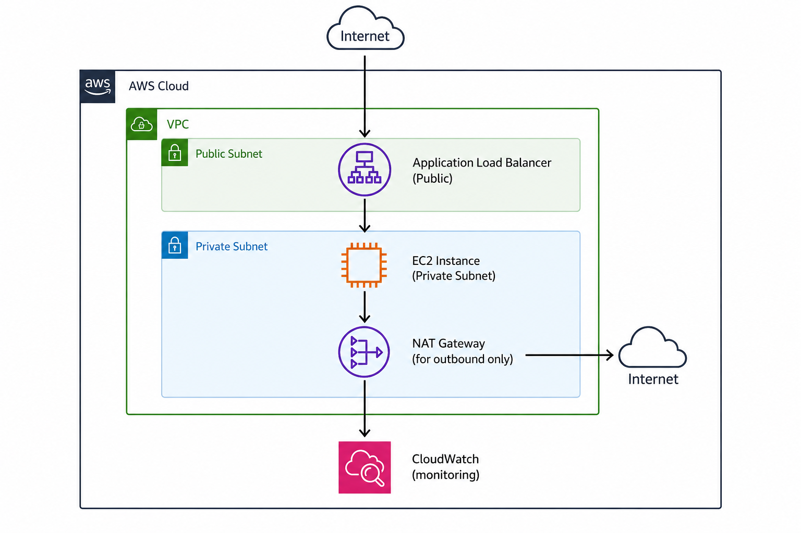
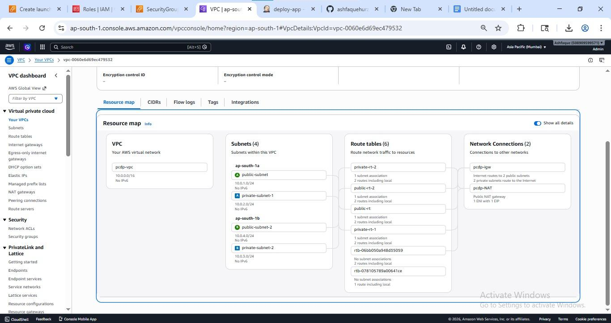
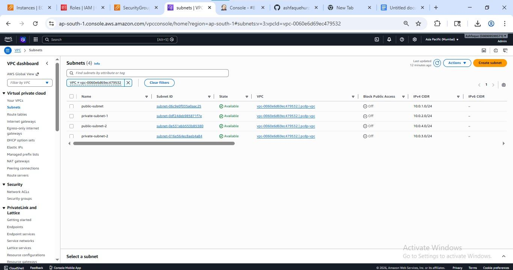
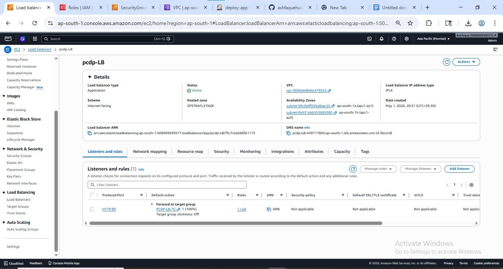
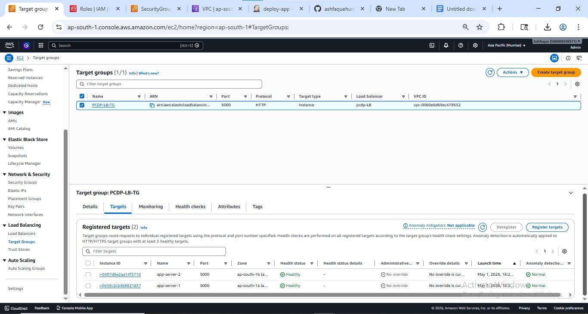
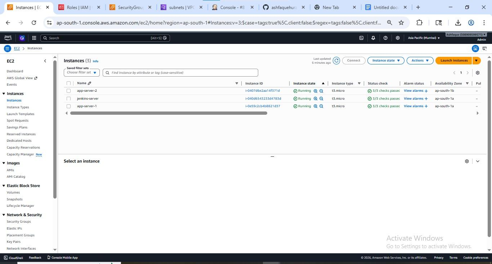
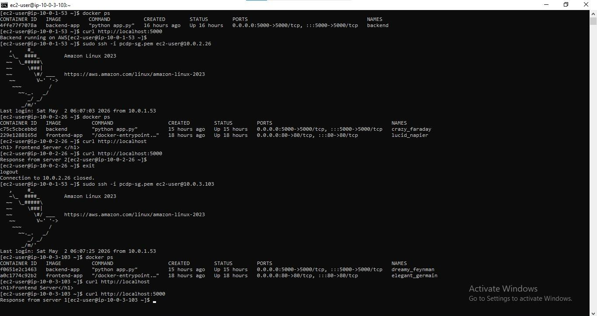
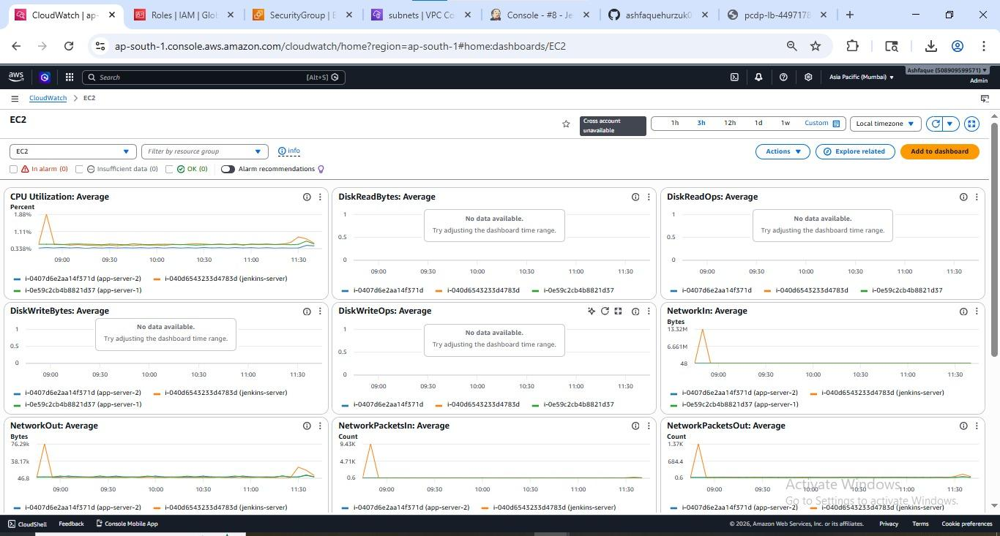
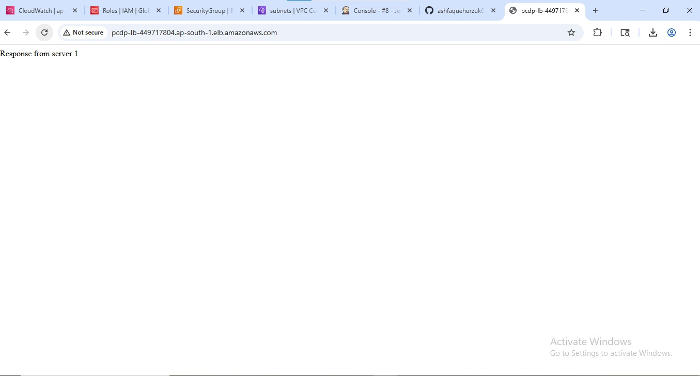
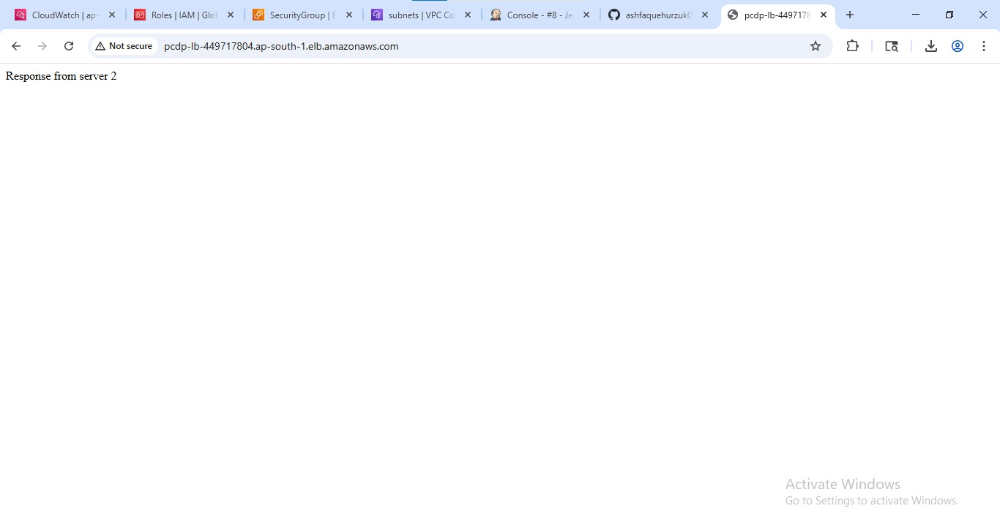

# AWS Multi-Tier DevOps Deployment

## What This Does
Deploys a containerised Python Flask app on AWS using a multi-tier 
architecture with Jenkins CI/CD automation, Docker, and an 
Application Load Balancer across private and public subnets.

## Architecture


## Tech Stack
AWS (VPC, EC2, ALB, NAT Gateway, IAM, CloudWatch) | Docker | Jenkins | Python Flask

## How It Works
1. Developer pushes code to GitHub
2. Jenkins detects the push and triggers the pipeline
3. Jenkins builds a Docker image and tags it with build number
4. Image is pushed to DockerHub
5. Jenkins pulls the image on EC2 and runs the container
6. ALB routes traffic to the running container

## How to Deploy

### Prerequisites
- AWS account with EC2 access
- DockerHub account
- Jenkins installed on EC2 (public subnet)

### Steps
```bash
# On Jenkins EC2 — install Docker and add jenkins to docker group
sudo yum install docker -y
sudo systemctl start docker
sudo usermod -aG docker jenkins
sudo systemctl restart jenkins

# Clone the repo
git clone https://github.com/ashfaquehurzuk0/aws-devops-project.git

# Build and test locally first
cd aws-devops-project
docker build -t flask-app .
docker run -d -p 5000:5000 flask-app
# Visit http://localhost:5000
```

### Jenkins Setup
1. Create a Freestyle job in Jenkins
2. Set GitHub repo URL under Source Code Management
3. Add DockerHub credentials (ID: `dockerhub-creds`)
4. Add GitHub webhook: `http://43.204.116.61:8080/github-webhook/`
5. Push any commit — pipeline triggers automatically

## Problems I Solved
- **Docker auth error in Jenkins** → Fixed by adding jenkins user to docker group: `usermod -aG docker jenkins`
- **Jenkins permission conflict** → Resolved by configuring sudoers for jenkins user
- **Port mapping failure** → Fixed incorrect EXPOSE vs -p flag mismatch in Dockerfile

## Screenshots

### VPC Architecture


### Subnets


### Application Load Balancer


### Target Group


### EC2 Instances


### Docker Container Running


### CloudWatch Monitoring


### Final Output



## Key Learnings
- How public/private subnet architecture protects application servers
- How ALB health checks and target groups work in practice
- How Jenkins automates Docker build and deployment end to end
- How IAM roles replace hardcoded credentials for secure AWS access
- How NAT Gateway enables outbound access without exposing private instances

## Author
**Ashfaque Hurzuk** - Cloud and DevOps Engineer | Navi Mumbai
[LinkedIn](https://www.linkedin.com/in/ashfaque-hurzuk-a2b8a637a) |
[GitHub](https://github.com/ashfaquehurzuk0)
