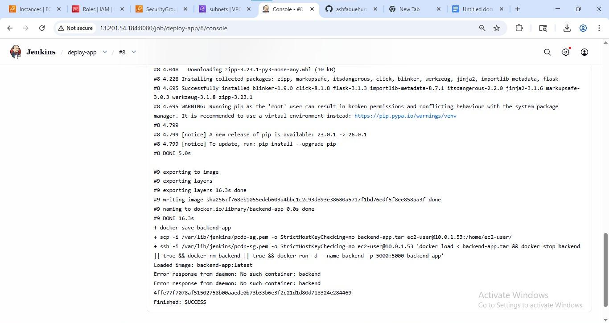

# AWS Multi-Tier DevOps Deployment with Load Balancer

## Project Overview
Built a production-style multi-tier cloud infrastructure on AWS from scratch.
Custom VPC with public and private subnets across two Availability Zones,
Application Load Balancer routing traffic to Docker-containerised EC2 instances,
Jenkins CI/CD pipeline automating deployments, and CloudWatch monitoring —
all secured with IAM roles and Security Groups.

## Architecture
- VPC with public and private subnets across 2 Availability Zones
- Application Load Balancer (ALB) routing traffic to private EC2 instances
- NAT Gateway for secure outbound internet access from private subnets
- Python Flask app containerised with Docker and deployed on EC2
- Jenkins Freestyle CI/CD pipeline automating build and deployment
- CloudWatch for infrastructure monitoring
- IAM roles and Security Groups enforcing least-privilege access

## Tech Stack
| Tool | Purpose |
|------|---------|
| AWS EC2 | Application servers in private subnets |
| AWS VPC | Network isolation and routing |
| AWS ALB | Load balancing and traffic distribution |
| AWS IAM | Access control and permissions |
| AWS CloudWatch | Monitoring and alerting |
| Docker | Application containerisation |
| Jenkins | CI/CD pipeline automation |
| Python Flask | Web application |
| Git & GitHub | Version control | 

## Project Steps
### Step 1 - VPC and Network Setup
- Created VPC with custom CIDR block
- Created public subnets (for ALB) and private subnets (for EC2) across 2 AZs
- Attached Internet Gateway for public subnet internet access
- Configured NAT Gateway in public subnet for private instance outbound access
- Set up route tables for both public and private subnets

### Step 2 - EC2 and Security Groups
- Launched EC2 instances in private subnets
- Security Group: ALB allows port 80 from internet, EC2 allows port 80 only from ALB

### Step 3 - Application Load Balancer
- Created ALB in public subnets
- Created Target Group pointing to private EC2 instances
- Configured health checks and listener rules

### Step 4 - Docker and Application Deployment
- Built Docker image from Python Flask app using Dockerfile
- Ran container on EC2 instances with port mapping

### Step 5 - Jenkins CI/CD Pipeline
- Installed Jenkins on EC2
- Created Freestyle job to pull code, build Docker image, and deploy container
- Verified successful build via Jenkins console output

### Step 6 - Monitoring
- Configured CloudWatch to monitor EC2 CPU, network, and status checks

## Screenshots

### VPC Architecture

### Subnets

### Application Load Balancer

### Target Group

### EC2 Instances

### Jenkins CI/CD - Successful Build

### Docker Container Running

### CloudWatch Monitoring

### Final Output

## Key Learnings
- How public/private subnet architecture protects application servers
- How ALB health checks and target groups work in practice
- How Jenkins automates Docker build and deployment end to end
- How IAM roles replace hardcoded credentials for secure AWS access
- How NAT Gateway enables outbound access without exposing private instances

## Author
**Ashfaque Hurzuk** - Cloud and DevOps Engineer | Navi Mumbai
[LinkedIn](https://www.linkedin.com/in/ashfaque-hurzuk-a2b8a637a) |
[GitHub](https://github.com/ashfaquehurzuk0)
